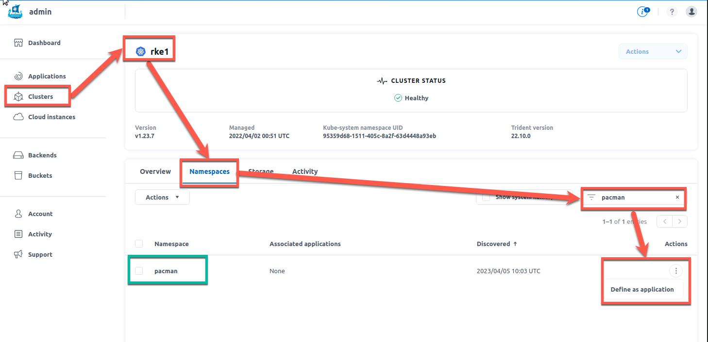
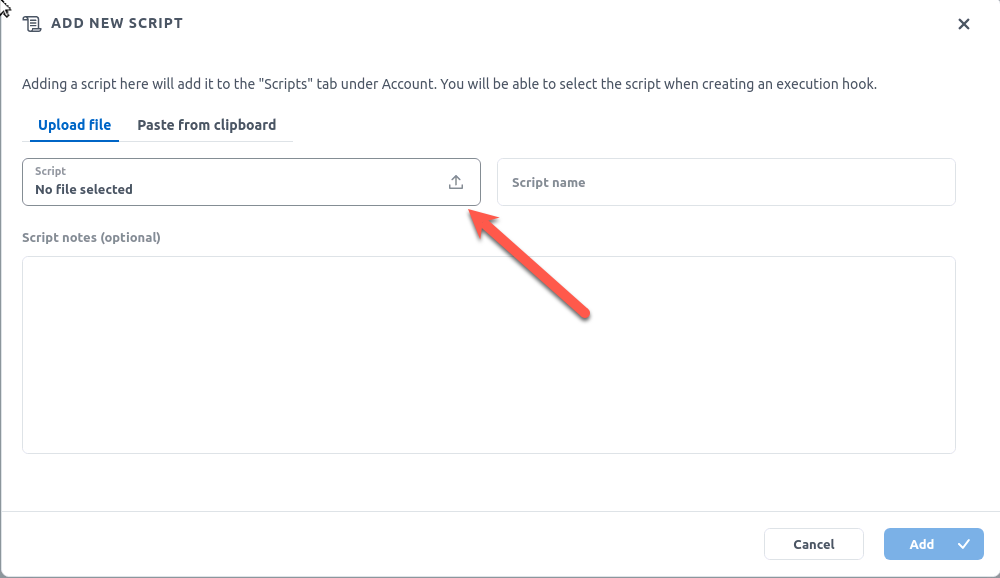
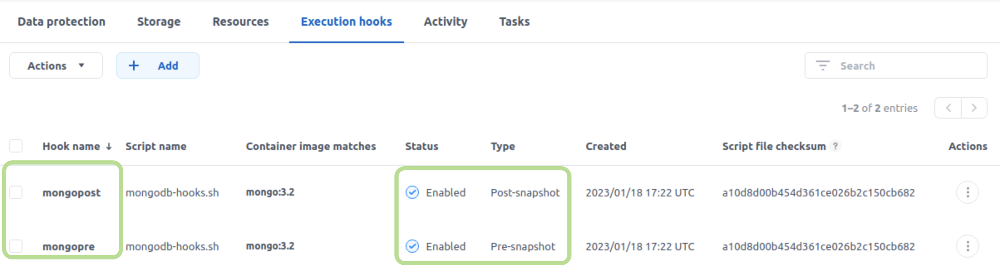
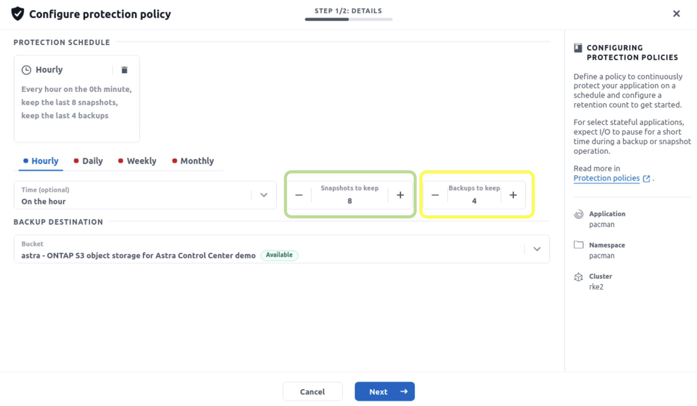
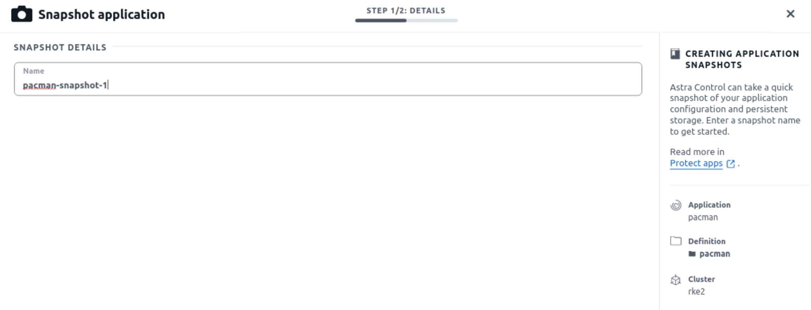

# :trident: NetApp Kompakt Live Lab 2023 - Datenmanagement in Kubernetes

# Introduction
You will work in the NetApp Lab on Demand environment, but we`ve prepared some more resources for you than the typical lab guide offers. A special thanks to our dear trusted colleague Yves Weisser (https://github.com/YvosOnTheHub) who created a lot of the code we are using in this lab. Before you can start, there are some preparations to do.

You will connect to a Linux jumphost from which you can access the training environment.
It will provide you two K8s clusters, two ONTAP Clusters,Tridend with preconfigured backend and a preconfigured nas storageclass.
## Prework

1. Access the lab environment:  
https://lod-bootcamp.netapp.com  
<span style="color:red">Please ignore the Lab Guide that is provided there and use this one</span>

2. Request the lab *Cloud-native Applications with Astra Control Center v1.3* and connect to the jumphost 

3. Open a terminal    

4. We've prepared some exercises for you that are hosted in a github repo. To have them available on your training environment, please create a directory, enter it and clone the repo with the following commands:  
```console
cd /home/user
git clone https://github.com/ntap-johanneswagner/kompaktlivelab23
```

You should now have several directories available. The lab is structured with different scenarios. Everything you need is placed in a folder with the same name. 

5. As this lab is used for different things and has a lot of stuff in it that might be confusing, please run this little cleanup script which removes all things you don't need in this workshop, updates the environment to a recent version and creates some necessary stuff.   
Please run the following commands:  
**You will be asked to enter the password for user during the script. It is "Netapp1!"**

```console
cd /home/user/kompaktlivelab23/prework
bash prework.sh
```

# :trident: Scenario 01 - storage classes, persistent volumes & persistent volume claims 
____
**Remember: All required files are in the folder */home/user/kompaktlivelab23/scenario01* please ensure that you are in this folder now. You can do this with the command** 
```console
cd /home/user/kompaktlivelab23/scenario01
```
____
In this scenario, you will create two StorageClasses, discovery their capabilities, create PVCs and do some basic troubleshooting. 
## 1. Backends and StorageClasses
You are using NetApp Astra Trident as the CSI driver in this lab. It is running in the namespace *trident*.
The backends in this environment are allready created. Take a brief moment to review them:

```console
kubectl get tbe -n trident
```
Let's see what StorageClasses have already in the cluster 

```console
kubectl get sc
```

It will show you that you have already one storageclas calles sc-nas-svm1. 

You can have a closer look into the details with the following command:

```console
kubectl describe sc sc-nas-svm1
```

Now let's create two further StorageClasses. We've already prepared the necessary files. There is one StorageClass prepared for the *san*  and one for *san-economy*.

The file you will use for *san* is called *rke1_sc_san.yaml*  
The command...

```console
cat rke1_sc_san.yaml
```

...will provide you the following output of the file:

```yaml
apiVersion: storage.k8s.io/v1
kind: StorageClass
metadata:
  name: sc-san-svm1
  annotations:
    storageclass.kubernetes.io/is-default-class: "true"
provisioner: csi.trident.netapp.io
parameters:
  backendType: "ontap-san"
  storagePools: "svm1-san:aggr1_cluster1_02"
  fsType: "ext4"
mountOptions:
   - discard
allowVolumeExpansion: true
```

You can see the following:
1. This StorageClass will be the default in this cluster (see "annotations")
2. NetApp Astra Trident is responsible for the provisioning of PVCs with this storage class (see "provisioner")
3. There are some parameters needed for this provisioner. In our case we have to tell them the backend type (e.g. nas, san), storagepools and fstype.
4. This volume can be expanded after it's creation.

Now let's compare with the one for *san-eco*:

```console
cat rke1_sc_saneco.yaml
```

You get a similar output here:

```yaml
apiVersion: storage.k8s.io/v1
kind: StorageClass
metadata:
  name: sc-san-eco-svm1
provisioner: csi.trident.netapp.io
parameters:
  backendType: "ontap-san-economy"
  storagePools: "svm1-san-eco:aggr1_cluster1_02"
  fsType: "ext4"
mountOptions:
   - discard
reclaimPolicy: Retain
allowVolumeExpansion: true
```

The biggest differences are: 
1. We will now use the ontap-san-economy driver. While the ontap-san driver creates one flexvol per lun (persistent volume), the ontap-san-economy will place many luns (persistent volumes) in one flexvol.
2. A reclaim policy is specified. We will come back to this later.

If you want to dive into the whole concept of StorageClasses, this is well documented here: https://kubernetes.io/docs/concepts/storage/storage-classes/

After all this theory, let's just add the StoraceClasses to your cluster:

```console
kubectl apply -f rke1_sc_san.yaml
kubectl apply -f rke1_sc_saneco.yaml
```

verify that you have now three StorageClasses:

```console
kubectl get sc
```

Note, as we defined the the sc-san-svm1 as default StorageClass, we now have two default StorageClasses which is not a good state and it is still a bug in k8s that this can happen. To specify the right one as default, we have to set one to false again. This can be done by the following command:  

```console
kubectl patch storageclass sc-san-svm1 -p '{"metadata": {"annotations":{"storageclass.kubernetes.io/is-default-class":"false"}}}'
```

You should now only have one StorageClass marked as default, verify it and continue. 

## 2. PVCs & PVs

As your cluster now has a CSI driver installed and also StorageClasses configured, you are all set to ask for storage. But don't be afraid. You will not have to open a ticket at your storage admin team or do some weird storage magic. We want a persistent volume, so let's claim one.  
The workflow isn't complex but important to understand. 

1. A user creates a PersistentVolumeClaim requesting a new PersistentVolume of a particular size from a Kubernetes StorageClass that was previously configured by someone.
2. The Kubernetes StorageClass identifies the CSI driver - in our case Trident - and includes parameters that tell Trident how to provision a volume for the requested class.
3. Trident provisions storage on a matching backend and creates a PersistentVolume in Kubernetes that tells Kubernetes how to find, mount, and treat the volume.
4. Kubernetes binds the PersistentVolumeClaim to the new PersistentVolume. Pods that include the PersistentVolumeClaim can now mount the PersistentVolume on any host that they runs on.

There are two files in your scenario01 folder, *firstpvc.yaml* and *secondpvc.yaml*, both a requesting a 5GiB Volume. Let's create a namespace first, called *funwithpvcs*. We then get the storage into this namespace...

```console
kubectl create namespace funwithpvcs
kubectl apply -f firstpvc.yaml -n funwithpvcs
kubectl apply -f secondpvc.yaml -n funwithpvcs
```

Kubernetes confirms, that both persistent volume claimes have been created. Great... or not? Let's have a look

```console
kubectl get pvc -n funwithpvcs
```

You can see that the PVC named *firstpvc* has a volume, and is in status *Bound*. The PVC with the name *secondpvc*  does not look that healthy, it is still in Status *Pending*. This means that the request is ongoing, K8s tries to get what you want, but for whatever reason it doesn't work.   
Luckily we can describe objects and see what the problem is!

```console
kubectl describe pvc secondpvc -n funwithpvcs
```

Ok we can see, that there is an issue with the StorageClass. But why?  
Everything that is requested in the PVC will be handed over to the provisioner that is defined in the StorageClass. In this case Trident gets a request for a RWX volume with 5GiB and for the backend "ontap-san".   
In contrast to K8s, the CSI Driver is aware what is possible and what not. It recognizes that a RWX volume isn't possible at this backend type (SAN/block storage) as this backend can only serve RWO and ROX. 

If you want to have your second pvc also running and still need RWX access mode, we have to modify the yaml file. Just switch the storage class to *storage-class-nas*. This StorageClass has a backend type that is able to provide RWX mode. Unfortunately a lot of things in a PVC are immutable after creation so before we can see whether this change is working or not, you have to delete the pvc again.
___
<details><summary>Click for the solution</summary>
Delete the pvc which is in pending state:

```console
kubectl delete -f secondpvc.yaml -n funwithpvcs
```

Edit the *secondpvc.yaml* file like this:

```yaml
apiVersion: v1
kind: PersistentVolumeClaim
metadata:
  name: secondpvc
spec:
  accessModes:
  - ReadWriteMany
  resources:
    requests:
      storage: 5Gi
  storageClassName: sc-nas-svm1
```
Apply the pvc again

```console
kubectl apply -f secondpvc.yaml -n funwithpvcs
```
</details>

___

After you have deleted the PVC, changed the StorageClass in the pvc file and applied it again, you should see that both pvcs are now bound.


```console
kubectl get pvc -n funwithpvcs
```


```sh
NAME        STATUS   VOLUME                                     CAPACITY   ACCESS MODES   STORAGECLASS      AGE
firstpvc    Bound    pvc-542ed6d9-6df6-4d00-8bea-57f0de4999ad   5Gi        RWO            sc-san-eco-svm1   4m15s
secondpvc   Bound    pvc-e3ec31a7-abf4-4223-a12d-3fc674e03cb9   5Gi        RWX            sc-nas-svm1       12s
```

Earlier we mentioned that a *PersistentVolume* is also created. Maybe you ask yourself where to see them. It is pretty easy, let's have a look at our recently created ones:

```console
kubectl get pv | grep funwithpvcs
```

```sh
pvc-05e82aee-759a-42a5-9bea-e85cdbea9f8b   5Gi        RWO            Retain           Bound    funwithpvcs/firstpvc                                        sc-san-eco-svm1            85s
pvc-d5db069f-e7a8-45f6-bd78-11a11dd9f178   5Gi        RWX            Delete           Bound    funwithpvcs/secondpvc                                       sc-nas-svm1                82s
```

You remember the ReclaimPolicy we definied in our StorageClass? We can see here that pur PVs have different policies. Let's delete both PVCs and see what happens.

```console
kubectl delete -f firstpvc.yaml -n funwithpvcs
kubectl delete -f secondpvc.yaml -n funwithpvcs
```

Let's have a look at PVCs and PVs now 

```console
kubectl get pvc -n funwithpvcs
kubectl get pv | grep funwithpvcs
```

Magic, both PVCs are gone (well... we advised k8s to remove them...) but one PV is still there? No not real magic, just the normal behaviour of the specified ReclaimPolicy. As described before, the default ReclaimPolicy is *Delete*. This means as soon as the corresponding PVC is deleted, the PV will be deleted too. In some use cases this would delete valuable data. To avoid this, you can set the ReclaimPolicy to *Retain*. If the PVC is deleted now, the PV will change its Status from *Bound* to *Released*. The PV could be used again.  

Awesome, you are now able to request storage...but as long as no appliaction is using that, there is no real sense of having persistent storage. Let's create an application that is able to do something with the storage. We don't want to show just the next Wordpress Demo and we want to have some fun. Due to this, we will now bring Pac-Man to Kubernetes.  

<p align="center"></p>

As you can see in the architecture picture, this app consists out of several parts. 
There are two services. One will expose the mongodb to the network, the other will expose the app to the network. Then we have our two deployments, one for the mongo-db the other is the application. Last but not least, our pvc where we ask for persistent storage, that is consumed by the mongo-db to store our very valuable data.
To make it more verbose for you, we've splitted all the parts into seperate files that are in your working directory and start with pacman-... We will start with deploying the database and then continue with the application itself.

First we need a place where Pac-Man can live. In Kubernetes, this is the namespace.

```console
kubectl create namespace pacman
```

Now let's start with deploying the storage we need for the mongo-db. Take a look at the file and create it afterwars

Have a look at the file for the pvc and create it afterwards:

```console
cat pacman-mongodb-pvc.yaml
kubectl apply -f pacman-mongodb-pvc.yaml -n pacman
```

You can verfiy that the pvc is there and bound:

```console
kubectl get pvc -n pacman
```

Now as the PVC is there, have a look at the file for the database deployment and create it afterwards:

```console
cat pacman-mongodb-deployment.yaml
kubectl apply -f pacman-mongodb-deployment.yaml -n pacman
```

You should be able to see the container running:

```console
kubectl get pods -n pacman
```

We have a running container, we have storage for the mongodb, now we need a service that the app can access the database. Have a look at the file and create them afterwards:

```console
cat pacman-mongodb-service.yaml
kubectl apply -f pacman-mongodb-service.yaml -n pacman
```

You should have now one service in your namespace:

```console
kubectl get svc -n pacman
```

Let's continue with the pacman application, we will start with the deployment, as there is no need for storage (remeber: we will store the data in the database). Have look at the file for the deployment and create it afterwards:

```console
cat pacman-app-deployment.yaml
kubectl apply -f pacman-app-deployment.yaml -n pacman
```

You should be able to see the containers running:

```console
kubectl get pods -n pacman
```

We have running containers, we have storage for the mongodb, we have connection between mongodb and the pacman application guess what is missing: A service to access pacman. Have a look at the files for the service and create it afterwards:

```console
cat pacman-app-service.yaml
kubectl apply -f pacman-app-service.yaml -n pacman 
```

Finaly let's check the services:

```console
kubectl get svc -n pacman
```  


```console
NAME     TYPE           CLUSTER-IP       EXTERNAL-IP     PORT(S)           AGE
mongo    LoadBalancer   172.26.223.182   192.168.0.215   27017:30967/TCP   16s
pacman   LoadBalancer   172.26.164.251   192.168.0.216   80:30552/TCP      14s  
```  

In my example, Pac-Man recieved the external IP 192.168.0.216. This IP adress may vary in your environment. Take the IP adress from your output, open the webbrowser in your jumphost and try to access Pac-Man

Have some fun, create some highscore, we will need that in a later lab.

# :trident: Scenario 02 - running out of space? Let's expand the volume 
____
**Remember: All required files are in the folder */home/user/kompaktlivelab23/scenario02* please ensure that you are in this folder now. You can do this with the command** 
```console
cd /home/user/kompaktlivelab23/scenario02
```
____
Sometimes you need more space than you thought before. For sure you could create a new volume, copy the data and work with the new bigger PVC but it is way easier to just expand the existing.

First let's check the StorageClasses

```console
kubectl get sc 
```

Look at the column *ALLOWVOLUMEEXPANSION*. As we specified earlier, all StorageClasses are set to *true*, which means PVCs that are created with this StorageClass can be expanded.  
NFS Resizing was introduced in K8S 1.11, while iSCSI resizing was introduced in K8S 1.16 (CSI)

Now let's create a PVC and a Centos POD using this PVC, in their own namespace called *resize".

```console
kubectl create namespace resize
kubectl apply -n resize -f pvc.yaml
kubectl apply -n resize -f pod-busybox-nas.yaml
```

Wait until the pod is in running state - you can check this with the command

```console
kubectl get pod -n resize
```

Finaly you should be able to see that the 5G volume is indeed mounted into the POD

```console
kubectl -n resize exec busyboxfile -- df -h /data
```

Resizing a PVC can be done in different ways. We will edit the original yaml file of the PVC & apply it again it.  
Look for the *storage* parameter in the spec part of the definition & change the value (in this example, we will use 15GB)
The provided command will open the pvc definition.

```console
vi pvc.yaml
```

change the size to 15Gi like in this example:

```yaml
spec:
  accessModes:
  - ReadWriteMany
  resources:
    requests:
      storage: 15Gi
  storageClassName: storage-class-nas
  volumeMode: Filesystem
```

you can insert something by pressing "i", exit the editor by pressing "ESC", type in :wq! to save&exit. 

After this just apply the pvc.yaml file again  

```console
kubectl apply -n resize -f pvc.yaml
```

Everything happens dynamically without any interruption. The results can be observed with the following commands:

```console
kubectl -n resize get pvc
kubectl -n resize exec busyboxfile -- df -h /data
```

This could also have been achieved by using the *kubectl patch* command. Try the following:

```console
kubectl patch -n resize pvc pvc-to-resize-file -p '{"spec":{"resources":{"requests":{"storage":"20Gi"}}}}'
```

So increasing is easy, what about decreasing? Try to set your volume to a lower space, use the edit or the patch mechanism from above.
___

<details><summary>Click for the solution</summary>

```console
kubectl patch -n resize pvc pvc-to-resize-file -p '{"spec":{"resources":{"requests":{"storage":"2Gi"}}}}'
```
</details>

___

Even if it would be technically possible to decrease the size of a NFS volume, K8s just doesn't allow it. So keep in mind: Bigger ever, smaller never. 

If you want to, clean up a little bit:

```console
kubectl delete namespace resize
```


# :trident: Scenario 03 -  snapshots, clones etc 
___
**Remember: All required files are in the folder */home/user/kompaktlivelab23/scenario03*. Please ensure that you are in this folder. You can do this with the command** 
```console
cd /home/user/kompaktlivelab23/scenario03
```
___
CSI Snapshots have been promoted GA with Kubernetes 1.20.  
While snapshots can be used for many use cases, we will explore 2 different ones, which share the same initial process:

- Restore the snapshot in the current application
- Create a new POD which uses a PVC created from the snapshot (cloning)

There is also a chapter that will show you the impact of deletion between PVC, Snapshots & Clones (spoiler alert: no impact).  

We would recommended checking that the CSI Snapshot feature is actually enabled on this platform.  

This [link](https://github.com/kubernetes-csi/external-snapshotter) is a good read if you want to know more details about installing the CSI Snapshotter.
It is the responsibility of the Kubernetes distribution to provide the snapshot CRDs and Controller. Unfortunately some distributions do not include this. Therefore verify (and deploy it yourself if needed).

In our lab the **CRD** & **Snapshot-Controller** to enable this feature have already been installed. Let's see what we find:

```console
kubectl get crd | grep volumesnapshot
```

will show us the crds

```bash
volumesnapshotclasses.snapshot.storage.k8s.io         2020-08-29T21:08:34Z
volumesnapshotcontents.snapshot.storage.k8s.io        2020-08-29T21:08:55Z
volumesnapshots.snapshot.storage.k8s.io               2020-08-29T21:09:13Z
```

```console
kubectl get pods --all-namespaces -o=jsonpath='{range .items[*]}{"\n"}{range .spec.containers[*]}{.image}{", "}{end}{end}' | grep snapshot-controller
```

will show us the snapshot controller is running in our cluster:

```bash
k8s.gcr.io/sig-storage/snapshot-controller:v4.2.0,
k8s.gcr.io/sig-storage/snapshot-controller:v4.2.0,
```

Aside from the 3 CRDs & the Controller StatefulSet, the following objects have also been created during the installation of the CSI Snapshot feature:

- serviceaccount/snapshot-controller
- clusterrole.rbac.authorization.k8s.io/snapshot-controller-runner
- clusterrolebinding.rbac.authorization.k8s.io/snapshot-controller-role
- role.rbac.authorization.k8s.io/snapshot-controller-leaderelection
- rolebinding.rbac.authorization.k8s.io/snapshot-controller-leaderelection

Finally, you need to have a *VolumeSnapshotClass* object that connects the snapshot capability with the Trident CSI driver. In this Lab there is already one:

```console
kubectl get volumesnapshotclass
```

Note that the *deletionpolicy* parameter could also be set to *Retain*.

The _volume snapshot_ feature is now ready to be tested.

The following will walk you through the management of snapshots with a simple lightweight BusyBox container.

We've prepared all the necessary files for you to save a little time. Please prepare the environment with the following commands:

```console
kubectl create namespace busybox
kubectl apply -n busybox -f busybox.yaml
kubectl get -n busybox all,pvc
```

The last line will provide you an output of our example environment. There should be one running pod and a pvc with 10Gi.

Before we create a snapshot, let's write some data into our volume.  

```console
kubectl exec -n busybox $(kubectl get pod -n busybox -o name) -- sh -c 'echo "NetApp Kompakt Live Lab 2023 is fun. I will never use anything other than Astra Trident for persistent storage in K8s" > /data/test.txt'
```

This creates the file test.txt and writes "NetApp Kompakt Live Lab 2023 is fun. I will never use anything other than Astra Trident for persistent storage in K8s" into it. You can verify the file contents:

```console
kubectl exec -n busybox $(kubectl get pod -n busybox -o name) -- more /data/test.txt
```

Creating a snapshot of this volume is very simple:

```console
kubectl apply -n busybox -f pvc-snapshot.yaml
```

After it is created you can observe its details:
```console
kubectl get volumesnapshot -n busybox
```
Your snapshot has been created !  

To experiment with the snapshot, let's delete our test file...
```console
kubectl exec -n busybox $(kubectl get pod -n busybox -o name) -- rm -f /data/test.txt
```

If you want to verify that the data is really gone, feel free to try out the command from above that has shown you the contents of the file:

```console
kubectl exec -n busybox $(kubectl get pod -n busybox -o name) -- more /data/test.txt
```

One of the useful things K8s provides for snapshots is the ability to create a clone from it. 
If you take a look a the PVC manifest (_pvc_from_snap.yaml_), you can notice the reference to the snapshot:

```yaml
dataSource:
  name: mydata-snapshot
  kind: VolumeSnapshot
  apiGroup: snapshot.storage.k8s.io
```

Let's see how that turns out:

```console
kubectl apply -n busybox -f pvc_from_snap.yaml
```

This will create a new pvc which could be used instantly in an application. You can see it if you take a look at the pvcs in your namespace:

```console
kubectl get pvc -n busybox
```

Recover the data of your application

When it comes to data recovery, there are many ways to do so. If you want to recover only a single file, you can temporarily attach a PVC clone based on the snapshot to your pod and copy individual files back. Some storage systems also provide a convenient access to snapshots by presenting them as part of the filesystem (feel free to exec into the pod and look for the .snapshot folders on your PVC). However, if you want to recover everything, you can just update your application manifest to point to the clone, which is what we are going to try now:

```console
kubectl patch -n busybox deploy busybox -p '{"spec":{"template":{"spec":{"volumes":[{"name":"volume","persistentVolumeClaim":{"claimName":"mydata-from-snap"}}]}}}}'
```

That will trigger a new POD creation with the updated configuration

Now, if you look at the files this POD has access to (the PVC), you will see that the *lost data* (file: test.txt) is back!

```console
kubectl exec -n busybox $(kubectl get pod -n busybox -o name) -- ls -l /data/
```
or even better, lets have a look at the contents:

```console
kubectl exec -n busybox $(kubectl get pod -n busybox -o name) -- more /data/test.txt
```

Tadaaa, you have restored your data!  
Keep in mind that some applications may need some extra care once the data is restored (databases for instance). In a production setup you'll likely need a more full-blown backup/restore solution.  


Now, a little clean up at the end:

```console
kubectl delete ns busybox
```

# :trident: Scenario 04 - Consumption control 
___
**Remember: All required files are in the folder */home/user/kompaktlivelab23/scenario04*. Please ensure that you are in this folder. You can do this with the command**
```console
cd /home/user/kompaktlivelab23/scenario04
```
___
There are many different ways to control the storage consumption. We will focus on the possibilities of K8s itself. However please remember: Sometimes the same thing can also be achieved at storage or csi driver level and it might be preferred to do it there.

You can create different objects to control the storage consumption directly in Kubernetes:

- LimitRange: controls the maximum (& minimum) size for each claim in a namespace
- ResourceQuotas: limits the number of PVC or the amount of cumulative storage in a namespace

For this scenario we will create and work in the namespace *control*.

You will create two types of quotas:

1. Limit the number of PVC a user can create
2. Limit the total capacity a user can consume

Take a look at _rq-pvc-count-limit.yaml_ and _rq-sc-resource-limit.yaml_ and then apply them:

```console
kubectl create namespace control
kubectl apply -n control -f rq-pvc-count-limit.yaml
kubectl apply -n control -f rq-sc-resource-limit.yaml
```

You can see the specified ressource quotas with the following command:

```console
kubectl get resourcequota -n control
```

Nice, they are there - but what do they do? Let's take a closer look:

```console
kubectl describe quota pvc-count-limit -n control
```

Ok we see some limitations... but how do they work? Let's create some PVCs to find out

```console
kubectl apply -n control -f pvc-quotasc-1.yaml
kubectl apply -n control -f pvc-quotasc-2.yaml
```

Again, have a look at the ressource limits:

```console
kubectl describe quota pvc-count-limit -n control
```

Two in use, great, let's add a third one

```console
kubectl apply -n control -f pvc-quotasc-3.yaml
```

So far so good, all created, a look at our limits tells you that you got the maximum number of PVC allowed for this storage class. Let's see what happens next...

```console
kubectl apply -n control -f pvc-quotasc-4.yaml
```

Oh! An Error... well that's what we expected as we want to limit the creation, right?
Before we continue, let's clean up a little bit:

```console
kubectl delete pvc -n control --all
```

Time to look at the capacity quotas...

```console
kubectl describe quota sc-resource-limit -n control
```

Each PVC you are going to use is 5GB.

```console
kubectl apply -n control -f pvc-5Gi-1.yaml
```

A quick check:

```console
kubectl describe quota sc-resource-limit -n control
```

Given the size of the second PVC file, the creation should fail in this namespace

```console
kubectl apply -n control -f pvc-5Gi-2.yaml
```

And as expected, our limits are working. 

Before starting the second part of this scenario, let's clean up

```console
kubectl delete pvc -n control 5gb-1
kubectl delete resourcequota -n control --all
```

We will use the LimitRange object type to control the maximum size of the volumes a user can create in this namespace. 

```console
kubectl apply -n control -f lr-pvc.yaml
```

Let's verify:

```console
kubectl describe -n control limitrange storagelimits
```

Now that we have create a 2Gi limit, let's try to create a 5Gi volume...

```console
kubectl apply -n control -f pvc-5Gi-1.yaml
```

Magical, right? By the way, the NetApp Trident CSI driver from this lab has a similar parameter called _limitVolumeSize_ that controls the maximum capacity of a PVC per Trident Backend. As we told you: sometimes there are multiple ways to achieve the same result. 

# :trident: Scenario 05 - Protect& Recover your application with Astra Control Center 
___
**This time, no files are needed, all information are in the guide**
___
You remember the Pac-Man application we've created earlier? The one with the very very important highscore data? Having the data stored in persistent volumes is only the half of a good data management. We have also to ensure that if bad things are happening, we can recover from them. For this we will use Astra Control Centern (short ACC).   

We will use Astra Control Center to create :
- a manual snapshot (ie on-demand)
- a manual backup (ie on-demand)
- a protection policy to automatically take consistent snapshots & backups

All the work we will do in the UI can be done by API. We will work with the UI today as it is easier for demos.

To access the UI, open the webbrowser and choose NetApp Astra Control Center

<p align="center"></p>

To login use the username *admin@demo.netapp.com* and the password *Netapp1!*

<p align="center"></p>

Pacman runs on RKE1, so let's discover it in ACC.  
You can either browse through the numerous namespaces already present on RKE1 (_not that many_ ...), or filter directly with the namespace name:  
<p align="center"></p>

Once you define this namespace as an ACC application, the first task run by ACC will be create a list of all resources that compose Pacman.  
Back to the applications screen of ACC, you will see a _healthy_ Pacman, which is however _not protected_ (just yet).
<p align="center"></p>

One of the many strengths of Astra Control is to integrate with the applications to protect, through hooks, in order to create consistent snapshots & backups. Some hooks are already available on this [link](https://github.com/NetApp/Verda). 
You can add the scripts while creating a new hook or as they are global anyway, you can add them before creating a hook.
Let's start to add a script for the mongo db hooks. 

<p align="center"></p>

You could paste the code directly from your clipboard or just upload a ready script.

<p align="center"></p>

The Verda repository is cloned to the user directory of the jumphost, so we can upload the script from an existing file. It is located at /user/Verda/MongoDB

<p align="center"></p>
<p align="center"></p>

After a click on "Add", you should now see the added script in your Account

<p align="center"></p>

Let's create a _pre-snapshot_ & a _post-snapshot_ hooks for the MongoDB in the pacman app as this is the underlying database used to store the scores of this game. 

First you have to go back to the application and access its details:

<p align="center"></p>

Now you have to go to the Execution Hooks section and add a new one:

<p align="center"></p>

You could decide to apply hooks to all containers of an application, or just specific containers with a filtering option. We will choose the latter & filter on `.*mongo.*` in order to manage the database. Create two hooks, one for pre-snapshot and one for post-snapshot  

<p align="center"></p>   

<p align="center"></p>

Once done, you can see that the hooks have been applied on the right container, with the _mongo:3.2_ image.
<p align="center"></p>

Let's click on the _Data Protection_ tab to create a _Protection Policy_.
<p align="center"></p>

These policies will define when you take a _snapshot_, how many you want to keep at one point in time, & how many are to the _backup_ platform.
<p align="center"></p>

We can also manually create snapshots if you dont/cant wait for the first automated snapshot to be taken.  
It is as easy as just chosing a name for this snapshot:
<p align="center"></p>

It just takes a few seconds to complete. You end up with a healthy brand new snapshot.  
<p align="center"></p>

The same applies to _backups_. Let's manually create one, based on the snapshot we just added.
<p align="center"></p>

It takes a little bit more time (couple of minutes) to complete, as there is data movement involved this time.  
Nonetheless, we end up with a healthy backup.
<p align="center"></p>

With _snapshots_, _backups_ configured, now Pacman is protected from all evil !
<p align="center"></p>

In addition to snapshots and backups, Astra Control Center is also offering a replication for DR purposes. Due to time constraints we are not covering this in the LiveLab

Now let's brake some stuff and recover it.

We currently are in a safe zone. Pacman is running. Snapshots & backups are planned, as well as mirroring.  
Similarly to most fairy tales, an evil person joins the party !

```bash
kubectl exec -it -n pacman $(kubectl get pod -n pacman -l "name=mongo" -o name) -- mongo --eval 'db.highscore.updateMany({},{$set:{name:"EVIL",cloud:"YOU",zone:"HAVE BEEN",host:"HACKED",score:"666"}});' pacman
```

<p align="center">:boom: :boom: :boom: :boom: :boom: :boom: :boom: :boom: :boom: :boom: :boom: :boom: :boom: :boom: :boom: :boom:</p>  
<p align="center"></p>
<p align="center">:boom: :boom: :boom: :boom: :boom: :boom: :boom: :boom: :boom: :boom: :boom: :boom: :boom: :boom: :boom: :boom:</p>  

As a great wise man would say: "oh oh !"  

No worries, you did all the necessary to protect your application.  
In your case, you can simply perform an _in place restore_ operation from the first manual backup you took.

For this, enter the pacman application again, go to *Data protection*, choose *backups* and click on *Restore application*.  
<p align="center"></p>

<p align="center"></p>

When clicking on _Next_, you will also need to confirm the restore operation, as you will replace the existing content with the backup.  
After a few minutes, there you go, the famous high scores are back ! It might be that the IP adress of the pacman app is changed as we did a complete restore of the application. Just do a `kubectl get svc -n pacman` to verify that you are trying to access the right IP.

<p align="center"></p>

& Once again, Astra Control saved the world from evil !

# :trident: The End :trident:

Thank you for participating in this NetApp Kompakt LiveLab. We hope it was fun and you've learned something. We tried to cover the basics, there is a lot more to learn and talk. If you want to discuss further, cfeel free to reach out to us online or contact your NetApp Account Team and ask them to schedule a meeting with us.

Hendrik Land: [Linkedin](https://www.linkedin.com/in/hendrik-land/) / [E-Mail](mailto:hendrik.land@netapp.com)

Johannes Wagner: [Linkedin](https://www.linkedin.com/in/johwagner/) / [E-Mail](mailto:johannes.wagner@netapp.com)


